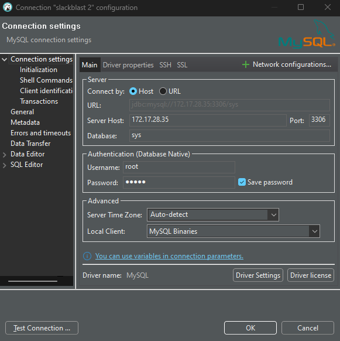

# F3 Nation Slack Bot

[](https://github.com/astral-sh/ruff)

F3 Nation is a Slack bot you can install to your workspace to help you with all things F3, including scheduling, region / AO managment, attendance tracking, and more. This bot is meant to eventually replace paxminer/slackblast, qsignups, and weaselbot.

Installation is as simple as a [simple link click](#getting-started-) (with eventual addition to the official Slack app directory?)

# Getting started

Installation to your Slack workspace is simple:
1. Click TBD link from a desktop computer
2. Make sure to select your region in the upper right if you are signed into multiple spaces

To get started, use the `/f3-nation-settings` command to start setting your schedule and preferences.
                                                                         
# Calendar

To set your schedule, use the calendar menu in `/f3-nation-settings`. Once your schedule is up, you can visit the calendar by using the `/calendar` command.

# Contributing

The F3 Nation Slack Bot is in active development, and I welcome any and all help or contributions! Feel free to leave an [Issue](https://github.com/F3-Nation/f3-nation-slack-bot/issues) with bugs or feature requests, or even better leave us a [Pull Request](https://github.com/F3-Nation/f3-nation-slack-bot/pulls).

## Active todo list:

### New functionality
- [ ] Nearby Regions
- [ ] Achievements
- [ ] Add ability for not using the calendar
- [ ] My stats command

### Preblast and Backblast
- [ ] Settings for default channel not yet working
- [ ] Need to incorporate reminder settings

### Attendance
- [ ] Want to make it unique to user_id and event_id... will require some logic changes

### Adding location on AO screen
- [ ] doesn't seem to pick up default location_id

- [ ] **Figure out migration :)**

## Local Development

If you'd like to contribute to the F3 Nation Slack Bot, I highly recommend setting up a local development environment for testing. Below are the steps to get it running (I did this in unix via WSL on Windows, YMMV on OSX):

### Development Environment:

If you don’t have a development environment of choice, I’m going to make two strong recommendations; VSCode is a VERY good and free IDE, and I would strongly make the case for using a unix environment.

1. **VSCode:** [Download Visual Studio Code - Mac, Linux, Windows](https://code.visualstudio.com/download)
2. **Unix environment:** if on Windows 10+, you can enable “Windows Subsystem for Linux” (WSL), that will allow you to run a version of linux directly on top of / inside of Windows. VSCode makes it very easy to “remote” into WSL: [Install WSL](https://learn.microsoft.com/en-us/windows/wsl/install) (I use Ubuntu FWIW).
3. **Python 3.12:** you may already have this, but if not I recommend pyenv to manage python installations: [pyenv/pyenv: Simple Python version management](https://github.com/pyenv/pyenv?tab=readme-ov-file#installation). Specifically, F3 Nation currently uses **Python 3.12**
4. **Postgresql:** this app uses postgresql 16 on the backend, so you will need to set up a local instance for testing. Instructions TBD
5. **Ngrok:** you will use this to forward network traffic to your locally running development app: [Download (ngrok.com)](https://ngrok.com/download). You will need to create a free account and install your authtoken: [Your Authtoken - ngrok](https://dashboard.ngrok.com/get-started/your-authtoken)
6. **Poetry:** I use Poetry for of my apps’ dependency / environment management: [Introduction | Documentation | Poetry - Python dependency management and packaging made easy (python-poetry.org)](https://python-poetry.org/docs/)
7. **Git:** Git should be installed in most unix environments, here’s unix: [Git (git-scm.com)](https://git-scm.com/download/linux)
8. **Nodemon:** this is a useful utility for having “hot reload” when you’re developing: [nodemon - npm (npmjs.com)](https://www.npmjs.com/package/nodemon). You will likely need to install npm: [How to install Node.js and NPM on WSL2 (cloudbytes.dev)](https://cloudbytes.dev/snippets/how-to-install-nodejs-and-npm-on-wsl2)
9. **VSCode extensions:** one of the best things about VSCode are the thousands of extensions that are available to help your coding experience
    - Once you will need for sure:
      - WSL (if using WSL)
      - Remote Explorer (may come with the one above)
      - Python Extention Pack
    - Some other favorites of mine
      - Github Copilot - has blown my mind on how good it is, but it is $10 a month
      - Gitlens
      - Error Lens
      - Ruff
      - Database Client JDBC

### Project setup

1. Clone the repo:
```sh
git clone https://github.com/F3-Nation/f3-nation-slack-bot.git
```
2. Use Poetry to install dependencies:
```sh
cd f3-nation-slack-bot
poetry env use 3.12
poetry install
```
3. Create your development Slack bot: 
    1. Navigate to [api.slack.com]()
    2. Click "Create an app"
    3. Click "From a manifest", select your workspace
    4. Paste in the manifest below
    5. After creating the app, you will need a couple of items: first, copy and save the Signing Secret from Basic Information. Second, copy and save the Bot User OAuth Token from OAuth & Permissions

```yaml
display_information:
  name: f3-nation-dev
  description: An invokable form to produce properly-formatted backblasts and preblasts
  background_color: "#000000"
features:
  bot_user:
    display_name: f3-Nation-Dev
    always_online: true
  slash_commands:
    - command: /preblast
      url: https://YOUR-URL.ngrok-free.app/slack/events # You'll be editing this
      description: Launch preblast template
      should_escape: false
    - command: /f3-nation-settings
      url: https://YOUR-URL.ngrok-free.app/slack/events # You'll be editing this
      description: Managers your region's settings for F3 Nation, including your schedule
      should_escape: false
    - command: /backblast
      url: https://YOUR-URL.ngrok-free.app/slack/events # You'll be editing this
      description: Launch backblast template
      should_escape: false
    - command: /tag-achievement
      url: https://YOUR-URL.ngrok-free.app/slack/events # You'll be editing this
      description: Lauches a form for manually tagging Weaselbot achievements
      should_escape: false
    - command: /send-announcement
      url: https://YOUR-URL.ngrok-free.app/slack/events # You'll be editing this
      description: Triggers a announcement send
      should_escape: false
oauth_config:
  redirect_urls:
    - https://YOUR-URL.ngrok-free.app/slack/install # You'll be editing this
  scopes:
    user:
      - files:write
    bot:
      - channels:history
      - channels:read
      - chat:write
      - chat:write.customize
      - chat:write.public
      - commands
      - files:read
      - im:history
      - im:read
      - im:write
      - team:read
      - users:read
      - files:write
settings:
  event_subscriptions:
    request_url: https://YOUR-URL.ngrok-free.app/slack/events # You'll be editing this
    bot_events:
      - team_join
  interactivity:
    is_enabled: true
    request_url: https://YOUR-URL.ngrok-free.app/slack/events # You'll be editing this
  org_deploy_enabled: false
  socket_mode_enabled: false
  token_rotation_enabled: false
```
4. Copy `.env.example`, replacing `ADMIN_DATABASE_PASSWORD` with the one you used to set up Postgresql, `SLACK_SIGNING_SECRET` and `SLACK_BOT_TOKEN` from your Slack setup above, and save the new file as `.env` in the base directory. There are several secrets you will need from Moneyball.
5. Initialize your local database by running the script:
```sh
source .env && poetry run python utilities/database/create_clear_local_db.py --reset
```
6. Run Ngrok with the following command from your terminal:
```sh
ngrok http 3000
```
7. Copy the Forwarding URL (has `ngrok-free.app` at the end)
8. Back in your browser for the Slack app, replace **all** of the YOUR_URLs with the ngrok Forwarding URL
9. You are now ready to roll! This would be a good time to make sure you're on your own branch :)
10. To run the app with "hot reload" (restarts anytime you save a file), run from the f3-nation-slack-bot subdirectory:
```sh
source .env && nodemon --exec "poetry run python main.py" -e py
```
11. Use ctrl-C to stop both Ngrok and nodemon
12. Repeat steps 6-11 whenever you stop and want to come back to your app

> [!NOTE]
> If you want to access your db, there's an excellent vscode extension called [Database Client JDBC](https://marketplace.visualstudio.com/items?itemName=cweijan.dbclient-jdbc). Note, if using WSL, your WSL's IP address CAN CHANGE, meaning you would need to edit your connection when it does. I got the Server Host port number by running `wsl hostname -I` from Powershell.



> [!NOTE]
> if you add or change packages via `poetry add ...`, you will need to also add it to `f3-nation-slack-bot/requirements.txt`. You can make sure that this file fully reflects the poetry virtual environment via: `poetry export -f requirements.txt -o requirements.txt --without-hashes`

